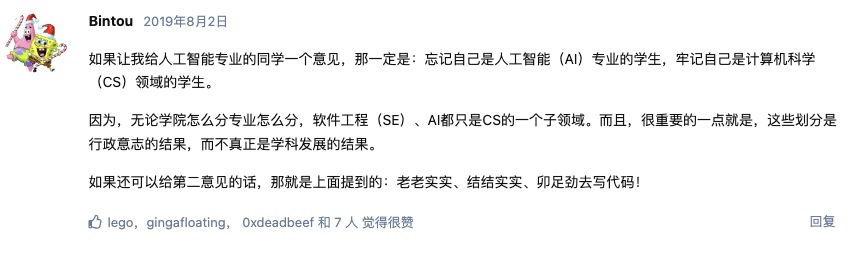

> “计算机科学教育不能使任何人成为专业程序员，就像研究画笔和颜料不能使任何人成为专业画家一样。”《新黑客词典》作者埃里克·雷蒙德说道。
> 
> 我曾雇佣过的最优秀的程序员只有高中文凭；他开发了许多优秀的软件，拥有自己的新闻组，并通过股票期权赚到足够买下自己夜总会。
> —— Jamie Zawinski

# 关于代码

> 嘴替，截图自0XFFFF论坛，[原帖](https://0xffff.one/d/329-xiao-bai-guan-yu-ren-zhi-de-yi-xie/3)

# 附录：语言选择

有几个人问过应该先学习哪种编程语言。没有一个确定的答案，但请考虑以下几点：

- 借助你的朋友。当被问到“我应该使用什么操作系统，Windows、Unix还是Mac？”时，我的回答通常是：“使用你的朋友们在用的。”从朋友那里学习所获得的优势将抵消操作系统或编程语言之间任何固有差异。还要考虑一下未来的朋友：如果你继续下去，你将成为程序员社区中的一员。你选择的编程语言是否拥有庞大而不断增长的社区？是否有书籍、网站和在线论坛可以获取答案？你喜欢那些论坛上的人吗？
  
- 保持简单。像C++和Java这样设计用于由经验丰富、关注代码运行效率并由大型开发团队进行专业开发工作的编程语言存在复杂部分。因此，这些语言具备了针对这些情况设计而来的复杂性能特点。然而，您关心学会如何编程，并不需要那种复杂性能特点。您需要一门旨在易于新手学习和记忆起来并且只需一个新手即可完成任务。
  
- 玩。你更愿意如何学习弹钢琴：正常的互动方式，即每按下一个键就能听到音符声音，还是“批处理”模式，在这种模式下只有在完成整首歌曲后才会听到音符？显然，互动模式使得学习钢琴和编程都更容易。坚持选择一门具备交互模式的语言并使用它。

翻译自[Teach Yourself Programming in Ten Years](https://norvig.com/21-days.html)